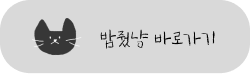

<div align='center' id="top">

# 🍚 밥줬냥 🐈‍⬛ 

</div>


   



```
[서비스 이용을 위한 test 계정]
📧 ID: feedmeow@email.com
🔒 PW: didhddidhd
```

## 개요

```
🍚 "밥줬냥"은 안전한 길고양이 급식소 관리를 위한 서비스입니다.  
📌 어디에 어떤 고양이가 살고 있는지 지도에 고양이 정보를 등록하고 위치를 확인할 수 있습니다.
🐟 고양이의 밥과 물, 간식을 시간별로 매일 체크하고 특이사항 또는 건강상태를 서로 공유할 수 있습니다.
🏘️ 동네냥 소식통 페이지에서 우리 동네 집사님들과 자유로운 소통을 할 수 있습니다.
📰 밥줬냥 신문을 통해 관리자가 등록한 고양이 관련 다양한 이야기를 접할 수 있습니다.
💛 내가 등록한 냥이 페이지에서 자신이 등록한 고양이들을 한 눈에 확인하고, 관리할 수 있습니다.
```

### 프로젝트 기간

>2022.10 ~ 2022.11

<br>
<br>

<div align='center'>

## 🙌 안녕하세요. Team i-dle(아이들) 입니다!

</div>

|이예은|우혜빈|전유진|김도희|남위정|
|:---:|:---:|:---:|:---:|:---:|
|||||
|<a href="https://github.com/leeyeun">🔗 leeyeun</a>|<a href="https://github.com/Hyebin-woo">🔗 Hyebin-woo</a>|<a href="https://github.com/ujin16">🔗 ujin16</a>|<a href="https://github.com/hee1231">🔗 hee1231</a>|<a href="https://github.com/Nam-Wijeong">🔗 Nam-Wijeong</a>|

저희는 프론트엔드 주니어 개발자이자 MBTI I(내향형)인 사람들이 모여 만들어진 팀입니다.
부트캠프 첫 날, 우리는 한 팀이 되어 만들고싶은 웹서비스 아이디어를 공유했습니다. 프론트엔드 개발 기초 지식조차 없던 우리는 함께 공부하고, 경험하며 막연했던 아이디어를 상세하게 구현해 낼 정도로 성장했습니다. 성장의  결과물을 "밥줬냥"을 통해 보여드리겠습니다.

<br>

**[목차]**

1. [프로젝트 동기 및 기획](#1-프로젝트-동기-및-기획)
2. [역할 분담](#2-역할-분담)
3. [구현 기능](#3-구현-기능)
4. [기술 및 개발환경](#4-기술-및-개발환경)
5. [UI 이미지](#img)
6. [구현 동작](#6-구현-동작)
7. [개발 이슈](#7-개발-이슈)
8. [링크](#8-노션-피그마-링크)

<br>
<br>


## 1. 프로젝트 동기 및 기획

**[동기]**

밥줬냥 프로젝트는 집을 오고 가면서, 혹은 여행을 갔다가 불쑥불쑥 마주치는 길 고양이들이 모두 건강히 우리 곁에 머물 수 있게 집사처럼 챙겨주는 따뜻한 마음에서 시작되었습니다. 내가 돌보는 동네 고양이들의 정보를 지도에 스팟으로 등록하고 밥과 간식을 시간별로 기록하며 길 고양이들이 무슨 일이 생길 경우 바로 달려갈 수 있는 캣맘, 캣대디가 될 수 있도록 기획하였습니다.

**[기획 과정]**

1) 플로우차트


2) 와이어프레임


<br>
<br>

## 2. 역할 분담


<br>
<br>

## 3. 구현 기능

-   🔐  **계정**
    -   로그인 / 로그아웃
    -   고양이 상식 문제풀기 → 회원가입
    -   회원 정보 수정
    -   정규표현식으로 유효성 검증
-   🏞  **지도 (Home)**
    -   카카오 지도 api 연동으로 고양이 위치 정보 등록
-   😸 **고양이 정보**
    -   이미지 파일 업로드, 미리보기
    -   등록 / 수정 / 삭제
    -   고양이 목록보기
-   🍚  **고양이 밥**
    -   등록 / 삭제
    -   밥 시간별로 보기
-   📰  **고양이 신문 보기**

<br>
<br>

## 4. 기술 및 개발환경

#### [기술 - FE]
    

-   BackEnd: 제공된 API 사용
-   Version

```
"react": "^18.2.0",
"react-router": "^6.3.0",
"styled-components": "^5.3.5",
"react-kakao-maps-sdk": "^1.1.5",
"typescript": "^4.9.3",
```

#### [개발환경]

|개발환경|선택한 방식|
|:---:|:---:|
|브랜치 전략|git-flow|
|이슈 관리|github-Issues|
|구조 관리|아토믹 디자인 패턴|
|정적 코드 분석 도구|ESLint|
|Code Formatter|Prettier|
|Communication|Github와 & Discord를 Webhook 연동|
|Design|Figma|
|배포 환경|Netlify| 


<br>
<br>

## 5. <span id="img">UI 이미지</span>


<br>
<br>

## 6. 구현 동작
<br>
<div>

|0. Splash|1. 회원가입(약관동의 & 퀴즈)|2. 로그인|
|:---:|:---:|:---:|
||| 

<br>


|3. 메인화면|4. 냥이 등록|5. 냥이 정보|
|:---:|:---:|:---:|
||| 


<br>

|5-1. 냥이 정보 수정|5-2. 냥이 밥주기|6. 동네냥 소식통 UI
|:---:|:---:|:---:|
||| 

<br>

|7. 밥줬냥 신문 UI|8. 로그아웃|9. 에러 페이지|
|:---:|:---:|:---:|
||| 

</div>

<br>
<br>

## 7. 개발 이슈

[👩🏻‍💻 김도희](https://misty-skink-bbb.notion.site/572d9c21df0142729ea38a94f556238a)<br>
[👩🏻‍💻 남위정](https://misty-skink-bbb.notion.site/d42932a4e11b41389ad34853304609d5)<br>
[👩🏻‍💻 우혜빈](https://misty-skink-bbb.notion.site/2d1570d8cead44ed9a4d6905b6675ed6)<br>
[👩🏻‍💻 이예은](https://misty-skink-bbb.notion.site/7a98488eacde4b10b4ed2b05a06a403c)<br>
[👩🏻‍💻 전유진](https://misty-skink-bbb.notion.site/99ed6e2a91144b4799b548c83a8494eb)

<br>
<br>

## 8. 노션, 피그마 링크

- [🐱 밥줬냥 Repo](https://github.com/FE-feed-meow/DidYouFeedMeow)   
- [📖 밥줬냥 Notion](https://github.com/FE-feed-meow/DidYouFeedMeow)

<br>
<br>
<br>
<br>

<div align="right">
	
### [TOP](#top)

</div>
